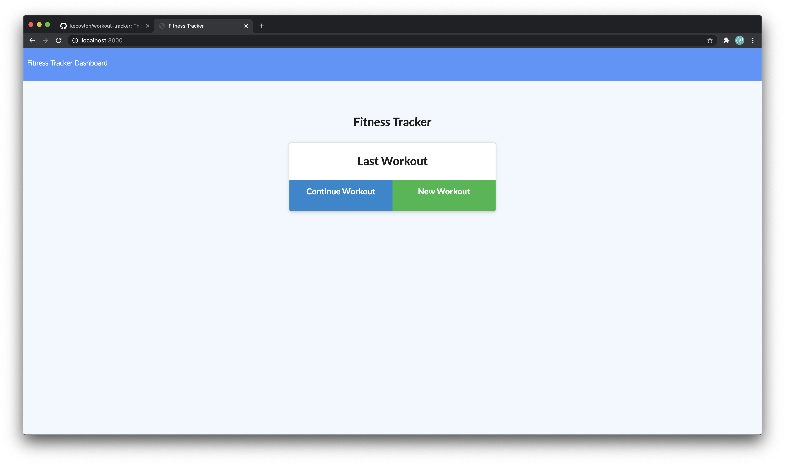
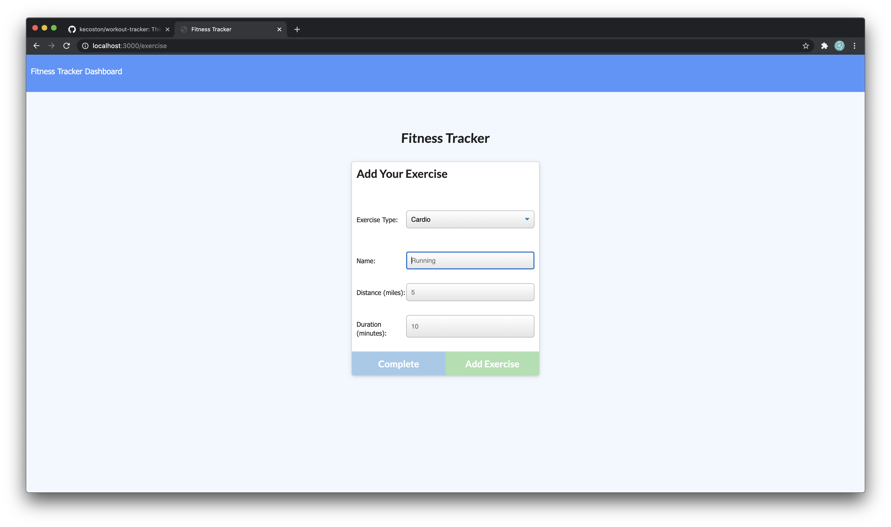
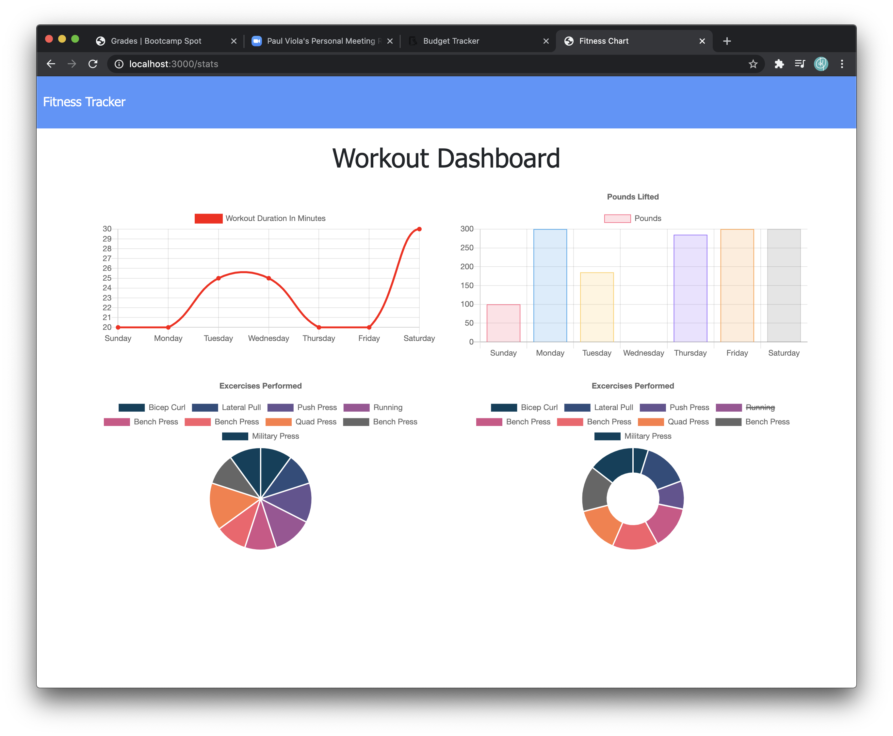

  ## Project: Workout Tracker

  # Description: 
  This app allows a user to view, create, and track daily workouts. They can log multiple exercises in a workout on a given day. They can also track the name, type, weight, sets, reps, and exercise duration.
  
  # Table of Contents:
  
  * [Title](#Project)
  * [Description](#Description)
  * [Installation](#Installation) 
  * [Usage](#User-Story)
  * [License](#License)
  * [Questions](#Questions)

  # Installation 
  This application uses express, mongoose, morgan, path, and router.

  # User-Story 
  First, the user will need to run an npm install to ensure all the dependencies are active. Then it is essential to run the seeds so that data is available in the database. Once this is done, the user can run the server and open the app in their browser.
  
  

  Once they arrive on the home page, they choose to continue an exercise or add a new workout. They will then need to enter the exercise details for it to be updated in the database. 
  
  
  
  If they navigate to the stats page by clicking on the Dashboard link in the top right, the user will see grids that visualize the data collected. 

  

  # Questions 
  Github Username: kecoston If you have any question you can email me at: kecoston@gmail.com

  #Licensing

  Workout Tracker  Copyright (C) 2020 kecoston

  